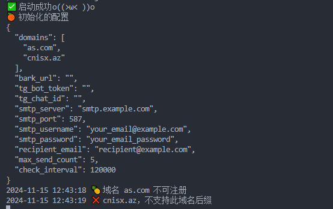

# Domain-Monitoring

域名监控服务：确保您不错过理想的域名

理想的域名往往一出现就被抢注，您是否担心错过注册完美域名的机会？

- 支持自动监控
- 支持自动注册域名
- 支持Bark、Telegram、email通知

## Use

在当前目录下新增配置文件*config.toml*内容如下

> 注意domains = [] 时不会启动服务

```bash

# 监听的域名
#domains = [] 
domains = ['consolog.com', 'cnisx.az', 'nicew.me'] 
# bark通知的url https://notify.xxxxx.com/ZWQUfXkN3yG25BsV6yVj4o/域名监控服务

bark_url = ''

# Dynadot API
# 是否开启自动注册（开启后如果余额充足，将自动注册域名）
auto_register = true
# 请在https://www.dynadot.com/zh/account/domain/setting/api.html获取dynadot_api_key
dynadot_api_key = ''

# Telegram 通知
tg_bot_token = ''
tg_chat_id = ''

# 邮箱通知
smtp_server = 'smtp.example.com'

# 根据服务商提供的端口，本人测试 126邮箱是465端口
smtp_port = 587
smtp_username = 'your_email@example.com'

# 授权密码, 非邮箱的登陆密码
smtp_password = 'your_email_password'
# 发送到邮箱
recipient_email = 'recipient@example.com'

# 成功发送次数，超过此数则不再通知
max_send_count = 5 

# 检测间隔 5分钟 ( 5 * 60 * 1000 毫秒)
# 建议请设置大于1分钟的时间间隔，小于1分钟可能导致检测失败
check_interval = 300000 

```

```bash

# run
docker run --name=domain -itd -v $(pwd)/config.toml:/app/config.toml move132/domain-monitor

# log

docker logs <container-id> -f

```

当出现下图时，表示已经启动成功



## License

MIT
